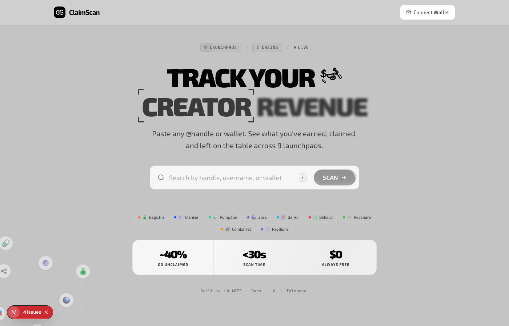
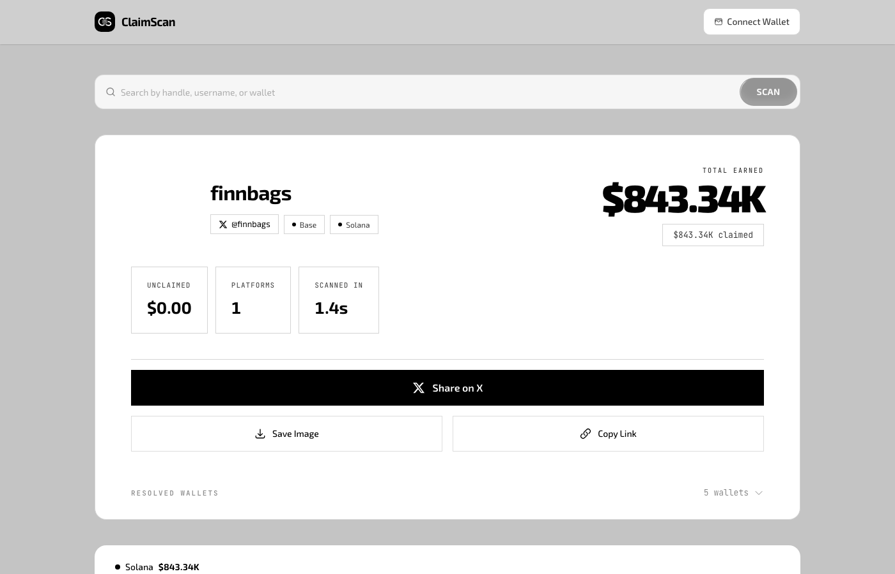

<div align="center">
  
  <h1>ClaimScan</h1>
  <p><strong>Cross-chain creator fee scanner, claimer, and paid intelligence API for DeFi launchpads on Solana, Base, Ethereum, and BNB Chain</strong></p>

  <p>
    
    
    
    
    
  </p>

  <p>
    <a href="https://claimscan.tech">Live App</a> · <a href="https://claimscan.tech/docs">Docs</a> · <a href="https://claimscan.tech/ClaimScan-Whitepaper-V1.pdf">Whitepaper V1.5</a>
  </p>
</div>

---

## What is ClaimScan?

ClaimScan is a free tool that scans and claims unclaimed creator fees across 10 DeFi launchpads on Solana, Base, Ethereum, and BNB Chain.

Around 40% of creator fees go unclaimed. Creators launch tokens, generate volume, earn fees, and never collect them. ClaimScan finds that money and lets you claim it.

**Paste any @handle or wallet. Get a full breakdown in under 30 seconds.**

<div align="center">
  
</div>

## How It Works

1. Paste a Twitter handle, GitHub username, Farcaster name, or wallet address
2. ClaimScan scans 10 launchpads across Solana, Base, Ethereum, and BNB Chain simultaneously
3. Full breakdown: earned, claimed, unclaimed in USD with live pricing
4. Connect your wallet and claim uncollected fees directly from ClaimScan

No signup. Read-only scanning. Zero-custody claiming. Always free.

<div align="center">
  
</div>

## Supported Platforms

### Solana
| Platform | Features |
|----------|----------|
| Bags.fm | Identity resolution, live polling, **direct claim with Turnstile + priority fees** |
| Pump.fun | Historical + live fee tracking (V1 and V2 supported) |
| Believe | Creator fee tracking |
| RevShare | Revenue share scanning |
| Coinbarrel | Fee discovery |
| Raydium | LaunchLab LP fee tracking |

### Base + Ethereum + BNB Chain
| Platform | Chain | Features |
|----------|-------|----------|
| Clanker | Base + BSC | Farcaster identity + fee tracking across both chains |
| Zora | Base + Ethereum | Creator protocol rewards, cross-chain |
| Bankr | Base | Fee recipient tracking |

## Features

### Scanning
- **4 chains**: Solana, Base, Ethereum, and BNB Chain in a single scan
- **Identity resolution**: Twitter, GitHub, Farcaster handles, ENS, and raw wallet addresses
- **Real-time streaming**: Scan progress updates as each platform completes via SSE
- **Live polling**: Unclaimed balances auto-update in real time
- **Dynamic dust filter**: Filters noise using live token prices
- **Shareable receipts**: OG image cards for social sharing
- **Privacy-first**: Searches anonymized before logging

### Claiming (V1.5) ✦ Bags.fm Live
V1.5 is the update where ClaimScan went from read-only scanner to full claimer. Bags.fm is the first platform with direct on-chain claiming built in. No third-party custody, no approvals, no token permissions. Connect your wallet, review the simulation, sign, done.

**How the claim flow works:**
1. ClaimScan detects unclaimed fees on Bags.fm for your wallet
2. A claim transaction is built server-side with optimized compute units
3. The transaction is simulated before it ever reaches your wallet
4. You review and sign in your own wallet (Phantom, Backpack, Ledger, or any Wallet Standard compatible wallet)
5. ClaimScan tracks the transaction from submission through on-chain finalization
6. Claim status updates in real time: `pending → signing → submitted → confirmed → finalized`

**Claim architecture:**
- **Zero-custody**: Your keys never leave your wallet. Transactions are constructed server-side but signed exclusively client-side
- **Pre-sign simulation**: Every transaction is simulated on-chain before the wallet prompt appears, so failed claims are caught before you spend gas
- **Priority fees**: Dynamic compute unit pricing calibrated per transaction for reliable confirmation, even during network congestion
- **Turnstile-gated**: Every claim request is verified through Cloudflare Turnstile to prevent bot abuse and replay attacks
- **Finalization tracking**: Claims are tracked end-to-end with immutable state transitions. Once finalized, a claim cannot be reverted or replayed
- **Cryptographic verification**: Claim requests are signed and verified at every step, from client to server to chain
- **Hardware wallet support**: Full compatibility with Ledger and other hardware signers
- **Auto-discovery**: Wallet detection via Wallet Standard protocol. No manual wallet imports needed

> More platforms coming in V2. Bags.fm is just the start.

### V2 API: Paid Intelligence for Agents and Developers ✦ New

ClaimScan V2 introduces a paid API powered by the [x402 protocol](https://x402.org). Any developer, bot, or AI agent can query ClaimScan data and pay per request in USDC. No API keys, no subscriptions, no accounts. Just pay and receive.

**Endpoints:**

| Endpoint | Price | What you get |
|----------|-------|--------------|
| `GET /api/v2/fees?wallet=<address>` | $0.01 | Full fee report across all 10 platforms and 4 chains |
| `GET /api/v2/export?wallet=<address>` | $0.05 | CSV or JSON export of all fee records |
| `GET /api/v2/intelligence?wallet=<address>` | $0.02 | Intelligence report: ClaimScan fees + Allium cross-chain enrichment |
| `GET /api/v2/resolve?ows_wallet=<name>` | Free | Resolve an OWS wallet name into multi-chain addresses |

**How it works:**

1. An agent or developer makes a request to any paid endpoint
2. ClaimScan responds with HTTP 402 (Payment Required)
3. The client signs a USDC payment on Base automatically
4. ClaimScan verifies the payment and returns the data

Compatible with [OWS (Open Wallet Standard)](https://openwallet.sh) for seamless agent access:

```bash
ows pay request "https://claimscan.tech/api/v2/intelligence?wallet=0x..." --wallet my-agent
```

**Powered by:**
- [x402](https://x402.org) for trustless per-request payments in USDC
- [Allium](https://allium.so) for cross-chain transaction history, PnL, and portfolio context
- [OWS](https://openwallet.sh) for multi-chain wallet identity and agent-friendly authentication

### Security
- **Defense in depth**: Multiple layers of abuse prevention across all endpoints
- **Bot protection**: Turnstile verification on sensitive operations
- **Request signing**: All client-server communication cryptographically signed
- **Zero-custody claiming**: Transactions signed exclusively in user wallets
- **Tamper-proof claims**: Claim states are immutable once finalized
- **On-chain verifiable**: Every fee record independently verifiable on-chain
- **Anti-enumeration**: Rate-limited identity resolution prevents scraping
- **Honeypot endpoints**: Fake data traps to detect and fingerprint scrapers

### Performance
- **Fast scans**: All routes optimized for parallel execution across 4 chains
- **Smart caching**: Multi-layer caching (Redis + DB) keeps data fresh without hammering the chain
- **Background indexing**: Automated token discovery via Helius DAS webhooks
- **Graceful degradation**: Partial results instead of timeouts
- **SSE streaming**: Real-time scan progress and live fee updates via Server-Sent Events

## Tech Stack

| Layer | Technology |
|-------|-----------|
| Framework | Next.js + React + TypeScript |
| Styling | Tailwind CSS + Radix UI + Motion |
| Blockchain | Solana (web3.js) + EVM (Viem) |
| Database | Supabase (PostgreSQL with row-level security) |
| Cache | Redis with in-memory fallback |
| Identity | Cross-platform resolution (Twitter, GitHub, Farcaster, wallets) |
| Pricing | Multi-source aggregation (DexScreener, Jupiter, CoinGecko) |
| Payments | x402 protocol (USDC on Base) |
| Intelligence | Allium (cross-chain wallet data) |
| Wallet Standard | OWS (Open Wallet Standard) for agent access |
| Monitoring | Sentry + structured logging |
| Security | Turnstile + HMAC signing + rate limiting + honeypots |
| Deploy | Vercel (Serverless) |

## Stats

- 10 launchpads supported
- 4 chains (Solana + Base + Ethereum + BNB Chain)
- Under 30 second scan time
- $0 to scan and claim (always free)
- Paid API starting at $0.01 per query

## Roadmap

| Version | Status | Highlights |
|---------|--------|------------|
| V1.0 | Live | 9 platforms, cross-chain scanning, identity resolution |
| **V1.5** | **Live** | First on-chain claim flow (Bags.fm), Turnstile + priority fees, defense-in-depth security, Helius DAS indexing |
| **V2.0** | **Live** | 10th platform (Raydium LaunchLab), 4 chains (added ETH + BSC), **paid API via x402**, Allium intelligence, OWS wallet support, Pump.fun V2 |
| V2.5 | Next | Token Fee Scanner (paste any CA), multi-platform claim |
| V3 | Planned | Automated claim scheduling, creator analytics, portfolio dashboard |

## Built By

**[LW ARTS](https://lwdesigns.art)** · [@lwartss](https://x.com/lwartss) · [t.me/lwarts](https://t.me/lwarts)

Fullstack Web3 studio. 408+ crypto projects delivered. $1.6B+ in market cap generated.

## License

Proprietary. All Rights Reserved. See [LICENSE](LICENSE) for full terms. View-only for personal reference. No use, copy, deploy, or derivative works without written permission from LW ARTS.
